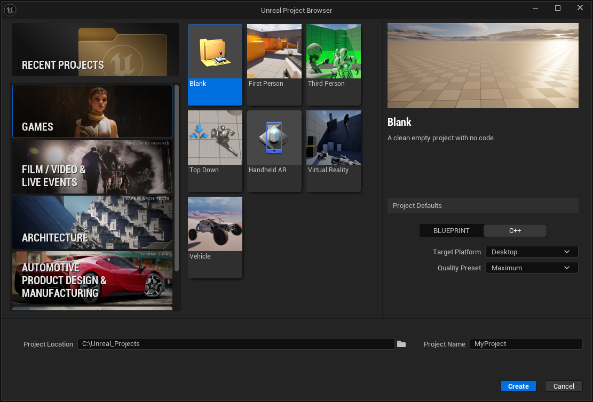
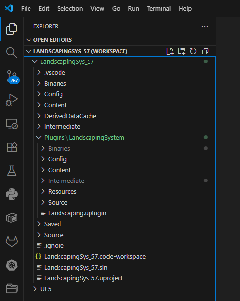

# Build

This guide shows how to build the plugin on all platforms with the example workflow depicting Windows. The process is the same for Linux and Mac OS using Visual Studio Code on all platforms.

> The plugin ships with the binaries built for Windows - therefore it can be used on Windows out of the box without the following steps.

## Installing Visual Studio Code

If not already installed, Visual Studio Code can be installed for free from [https://code.visualstudio.com/](https://code.visualstudio.com/).

## Create an Unreal Engine Project

Using the Epic Games Launcher or opening the Unreal `Engine` binary directly to open the `Unreal Project Browser`.  
  
  

Under `Project Defaults` select `C++`, and `Desktop` as target platform, give the project a name and create it. In this example, the project is called `LandscapingSys_57`. After the project has opened, close it again and continue with the install of the Landscaping System.

## Install Landscaping System

Install the `Landscaping System` into the Plugins folder of the created Project, whether from Unreal/Assetstore Loader or unpack the zip file and copy it to the projects plugin folder.  

  

## Build the plugin

Open the visual studio code project, it is called `<project name>.code-workspace` - `LandscapingSys_57.code-workspace` in this example. From the menu select `Terminal` -> `Run Build Task` and from the dropdown select `<project name>Editor Win64 Development Build` - `LandscapingSys_57Editor Win64 Development Build` in this example. `Win64` will be replaced by `Linux` or `Mac OS Arm64` if building on other platforms respectively.  

> Landscaping System for Mac OS includes binaries for Arm64 (M1, M2, ...), not the old intel processor architecture!

The build will start and after the build completes successfully, the plugin can be used in the Unreal Engine project.  

## Troubleshooting

### Linux

Tested Linux versions:  

- (K)Ubuntu 22.04
- (K)Ubuntu 24.04

#### Ubuntu 24.04

If messages like `Warning: dlopen failed: libaec.so.0: cannot open shared object file: No such file or directory` appear, run the `install_dependencies.sh` script in the plugins folder (needs sudo).
