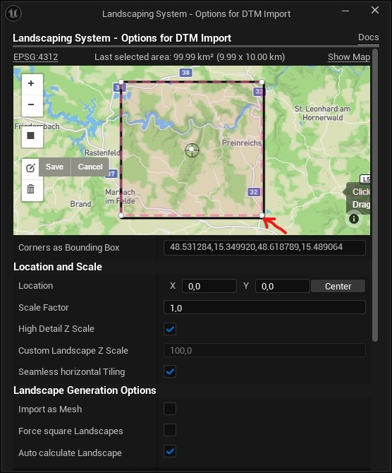

# Extending Landscapes

The plugin provides the ability to extend a Landscape. This is not the recommended way, but it may be useful if vast Landscapes should be created iteratively. It is also particularily useful to create backdrops (distant meshes).

> :bulb:  __Good to know__: For the playable area, the recommended way is to import large areas at once.  :bulb:

Said that, it is in principle possible to extend an imported area with additional raster files (geotiff, etc.) or terrain data from Mapbox. The additional area can include the original area.

> ❗ __Important__: To have seamless tiles, the data has to be from the same quality and the option [Seamless horizontal Tiling](heights.md?id=seamless-horizontal-tiling) has to be enabled! ❗

The size of a landscape tile will always be the size of the first imported landscape. The resolution however can be altered by unchecking [Resample to first Tile](heights.md?id=resample-to-first-tile). Additional imports will often completly overlap prior imports. Not wanted tiles can be deleted without side-effects.  

When working with heightdata from files (DTM/DEM, not Mapbox terrain) the area should be made a little smaller by dragging the lower right handle to the middle by a small amount in the `Options for DTM Import` map. Because for seamless tiling 1 pixel will be added in x and y direction on import. By making the area a little smaller, the connection will be seamless. See also [Landscape Technical Guide](https://dev.epicgames.com/documentation/en-us/unreal-engine/landscape-technical-guide-in-unreal-engine).

