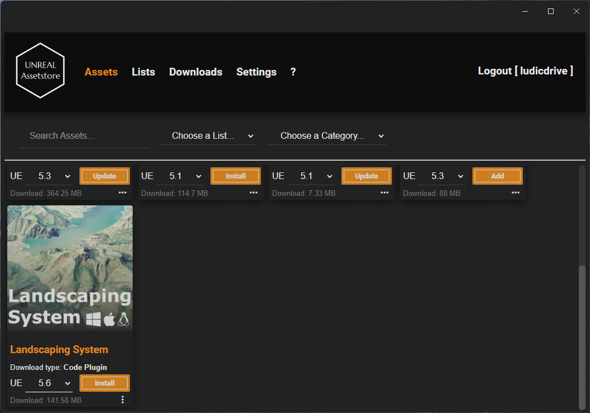
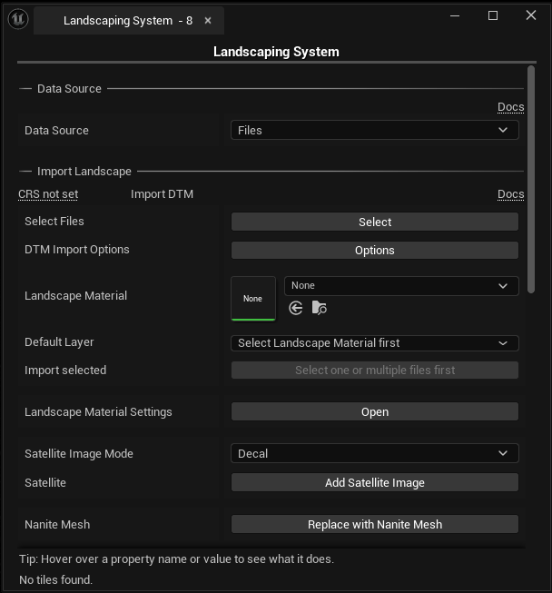
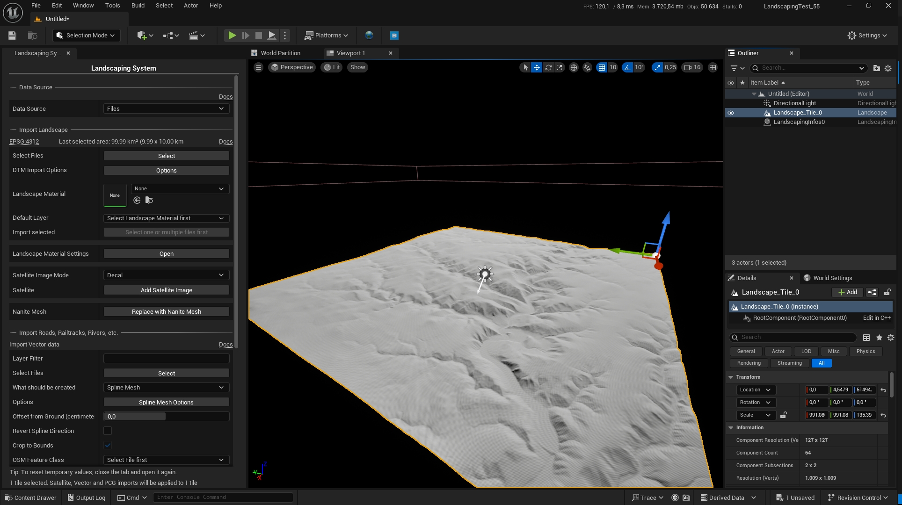

# Get started :smile:

## Install Landscaping System 🌍

The plugin can be downloaded using the [Unreal/Assetstore Loader](https://unrealassetstore.com/unreal-assetstore-loader/) or via the [Unreal/Assetstore Website](https://unrealassetstore.com/my-account/downloads/).  

### Unreal/Assetstore Loader

#### Windows 🪟

On Windows, the [Unreal/Assetstore Loader](https://unrealassetstore.com/unreal-assetstore-loader/) will automatically detect the Unreal Engine Versions installed on your system. You can choose an available version the plugin get's installed for that version engine-wide.

#### Linux 🐧 and MacOS 🍎

For Linux and MacOS, you can just select the projects `Plugins` folder to install the plugin for that specific project.

### Unreal/Assetstore Website

After downloading a specific version from the [Unreal/Assetstore Website](https://unrealassetstore.com/my-account/downloads/), extract the zipped file with 7zip, then copy it to the projects `Plugins` folder.

## Build

On Linux and Mac OS the plugin has to be built first - see [Build](build.md?id=build)

## Enable plugin

> ❗**Important**: the legacy *Landscaping* plugin cannot be used with __Landscaping System__ because __Landscaping System__ is fully backwards compatible and therefore the legacy *Landscaping* plugin must be removed before enabling __Landscaping System__ ❗

When installing the plugin to the Unreal Engines `Plugins` folder, you have to activate the plugin. This step is not necessary, if the plugin was installed into the projects `Plugins` folder.

1) In Unreal Engine, open the Plugins window (Edit -> Plugins)
2) Type 'Landscaping' in the search bar on top
3) On the entry reading `Landscaping System` check the checkbox next to 'Enabled'
4) Unreal Engine asks you for a restart
5) After Unreal Engine has restarted, you should see the __Landscaping System Icon__ 🌍 in the toolbar:  

## Import your first terrain with Landscaping System

> Download an example heightmap in [GeoTiff](https://drive.google.com/file/d/1t4-5z_U8M6OZkT0lp0JtgJ9u6CSNN5jo/view) format, or use another DTM (Digital Terrain Model) file or multiple files.

1) Start with a new empty level: Go to "File -> New Level -> __Empty Open World__ or __Empty Level__"
2) After clicking on the __Landscaping System Icon__ 🌍 on the toolbar, the __Landscaping System Tab__ pops up:  

3) Hit the `Select` button and choose your file or multiple files from above
4) Click on `Options` to open the DTM Import Options - a popup opens and you will see an interactive map showing the area which will be imported
5) Scroll to `Desired Max Tile Size` and increase the value to 12000. This will make sure, that only one landscape will be generated
6) Close the `DTM Options` and hit the `Import from Files` button - the landscape will be imported within a few seconds 🌍

With the file from above, the result will look like this.

> :bulb: **Good to know**: Every time you open a new level, you should close and re-open the __Landscaping System Tab__ for proper initialization. :bulb:

## Next steps

Apply a Landscape Material and generate weightmaps: [Landscape Material](landcover.md?id=landcover)
