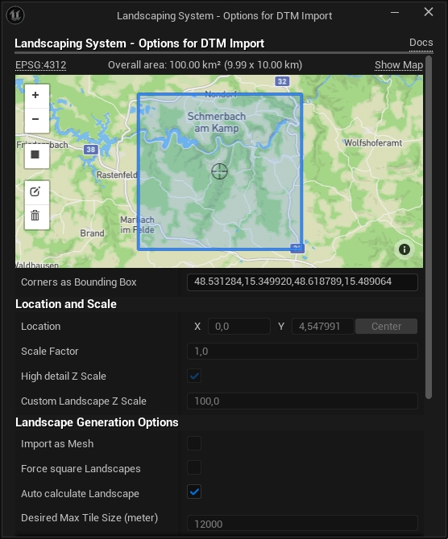

# Terrain

Landscaping System can import Digital Terrain Models (DTMs) from files or with the [Landscaping Mapbox](https://unrealassetstore.com/product/landscaping-mapbox) extension.

## Choosing input files

To load a DTM file, make sure the `Files` data source is selected and then click on the `Select` button.

> :bulb: __Good to know__: A terrain can be created from a single file or from multiple files. :bulb:

For both, `World Partition` and non-World-Partitioned Worlds, the `Desired Max Tile Size` will control the maximum size of a single landscape or mesh terrain. See Options below.

> :bulb: __Good to know__: To delete the loaded data from memory simply close the __Landscaping System Tab__ and open it again. :bulb:

## Options

The Landscaping System allows you to set the area to import with the `Corners as Bounding Box` input or directly in the DTM Import Options Dialog after loading the file. It is therefore possible to import only a smaller chunk of the loaded file.  
For downloading heightmaps from Mapbox using the [Landscaping Mapbox](https://unrealassetstore.com/product/landscaping-mapbox) plugin, the import area is specified here by selecting the desired area to import. (Please note, that Mapbox only provides terrain data for land areas, not sea areas).

  

## Import Area (optional)

You can view and/or select the area of the loaded file in the integrated browser. With the edit icon 📝 on the left side (second icon from the bottom), the area can be changed by dragging the corners of the rectangle.

After applying the new area the info text shows the new extent of the area. Only this part of the heightdata will be imported.

> ❗ __Important__: Unreal Engine needs a lot of RAM during the creation of a Landscape. Please make sure that you have enough RAM when importing huge areas! ❗

## Location and Scale

### Location

The X and Y Location of the Landscape will be at 0/0 per default. (first Tile, if multiple tiles are generated). The pivot of a Landscape is on the top-left corner. With `Center` the Landscape is positioned, so that it is centered in the UE coordinate system. If X and Y are set to 0, the Landscape will expand from 0 to the bottom and to the right.

> :bulb: __Good to know__: The Z Location is the real location ASL (above sea level) of the heightmap. :bulb:

### High Detail Z Scale

The vertical scale will be calculated automatically to perserve the most detail, using the maximum available Unreal Engine Landscape vertical resolution. Defaults to `true`.

### Custom Landscape Z Scale

Use this for areas with low altitude difference. Defaults to `100`. For understanding the technical reason for this, please consult [Calculating Heightmap Z Scale](https://docs.unrealengine.com/5.1/en-US/landscape-technical-guide-in-unreal-engine/).  

## Landscape Generation Options

### Import as Mesh

Import as Procedural Meshes instead of Landscape Actors (e.g. for a distance mesh). The Procedural Mesh can afterwards converted to a nanite mesh with a button in the __Landscaping System Tab__.

### Force square Landscapes

Always import square areas, regardles of the selection. This makes it possible to export/import weightmaps in the native UE Landscape Edit Mode (e.g. for editing weightmaps in another program). It's not affecting the real world scale, proportions will kept intact. Blank areas will most likely appear where no input data is found.

### Auto calculate Landscape

Calculate Sections and Components of the Landscape to import automatically given the extents of the input file. Uncheck to give custom specs (see properties below). It's not affecting the real world scale, proportions will kept intact.

### Section Size

Please see [Landscape Technical Guide](https://docs.unrealengine.com/5.2/en-US/landscape-technical-guide-in-unreal-engine/)

### Sections per Component

Please see [Landscape Technical Guide](https://docs.unrealengine.com/5.2/en-US/landscape-technical-guide-in-unreal-engine/)

### Number of Components

Please see [Landscape Technical Guide](https://docs.unrealengine.com/5.2/en-US/landscape-technical-guide-in-unreal-engine/)

### Landscape Resolution

Shows the expected Landscape Resolution in vertices as an estimate. Exact numbers can be found in the Details panel of the Landscape after import.

### Desired Max Tile Size

The maximum size of a created terrain imports in meter (Landscape or Mesh). If the size of a single Landscape exceeds this size, it will be split, and multiple Landscape Actors or meshes are created in the level. This is the size of the resulting Landscape in Unreal Engine, not the max size or resolution of a source file (like GeoTiff, etc.). E.g. a value of 32768 meter will import landscapes with maximum 32 km length or width. 32768 will need at least 64 GB of RAM with a input resolution of 1 meter/pixel. `Desired Max Landscape Size` defaults to `8192` meter.  

### World Partition Grid Size

Grid size for the World Partition Landscape. It is possible to specify the grid size of the World Partition to segment a Landscape into Landscape Streaming Proxies. For performance it is best to have only one landscape in a scene, which is divided in Landscape Streaming Proxies automatically.

> Please make sure you use the `Empty Open World` Template when using World Partition and check `Enable Streaming` in World Settings.

### Use native Raster Pixel Size

Use the pixel size from the imported DTM. Uncheck to use custom Raster Pixel Size below.

### Custom Raster Pixel Size

Set a custom pixel size for the imported DTN. The TDM will be resampled to this pixel size (meter/pixel) before import. Lower values will result in more pixel per meter (more vertices in a Landscape/Mesh, also needs more RAM).

### Resample to First Tile

Will import all imported DTM files (or Mapbox height data) to the resolution of the first imported DTM of the level enabling seamless worlds with no gaps. This might lead to up- or downsampling depending on the first imported DTM.  

### Smooth Steps

Apply gaussian blur on the height data before importing the landscape. This will smooth raster data with low resolution.  
0 means, no smoothing will happen.
For Mapbox imports the recommended value is 1 for mountain terrain, and 2 for flat terrain.  

## Smooth Edges

When creating multiple Landscapes from DTM files (or Mapbox) in a level, this __should be disabled__ to have seamless connections on the edges of each Landscape. For a single Landscape this can be enabled savely. If it is disabled, the gaussian blur will not be applied on the edges.  

## Landscape Update Options

> This options is only meaningful, if you try to fill missing data with mapbox, otherwise a faster way to fill missing data is just selecting (`Select Files` button) all heightmap data (geotiff-, ascii- or hgt-files, also mixed is possible) and let them merge on import automatically.

### Update Landscape

Wheter to update an already imported area (area must be a Landscape)

### Only fill missing

Only update areas with no data.  
For more info on this see the tutorial video:  

### Minimum height tolarance

The distance between the lowest valid point of an already imported landscape and the bottom flat area (no data area) in centimeter

## Landscape Material (optional)

Assign a Landscape Material which will be applied to the imported Landscape.

## Default Layer (only valid if Landscape Material with Layers is selected)

The Landscape Material's default paint layer, with which the landscape will be filled.  
> :bulb: __Good to know__: Some Landscape Materials include a __Invisible__ layer, which makes the Landscape invisible. Make sure this layer is not selected. :bulb:
For more about Lanscape Materials see Chapter [Landscape Material](landcover.md).

## General

It is possible to import raster files with different projections and resolutions and they will be aligned properly. You do not have to worry about it. It is even possible to import GeoTiff, ASCII and HGT files toghether. However: files with different resolutions (meter per pixel) will be result in seams (where more detailed and less details heightmaps meet).

Landscaping can handle overlapping files. Datasets imported to the `Landscaping System` may intersect, they will be merged and result in a single terrain.

> ❗ __Important__: Temporary files are created upon import in the folder defined in `Project Settings -> Plugins -> Landscaping -> Cache Directory`. After import these files can be used for other applications or deleted. If the setting `Use in Memory Files`is selected, only files from mapbox will be temporarily saved to the `Cache Directory`. See [Settings](settings.md). ❗
