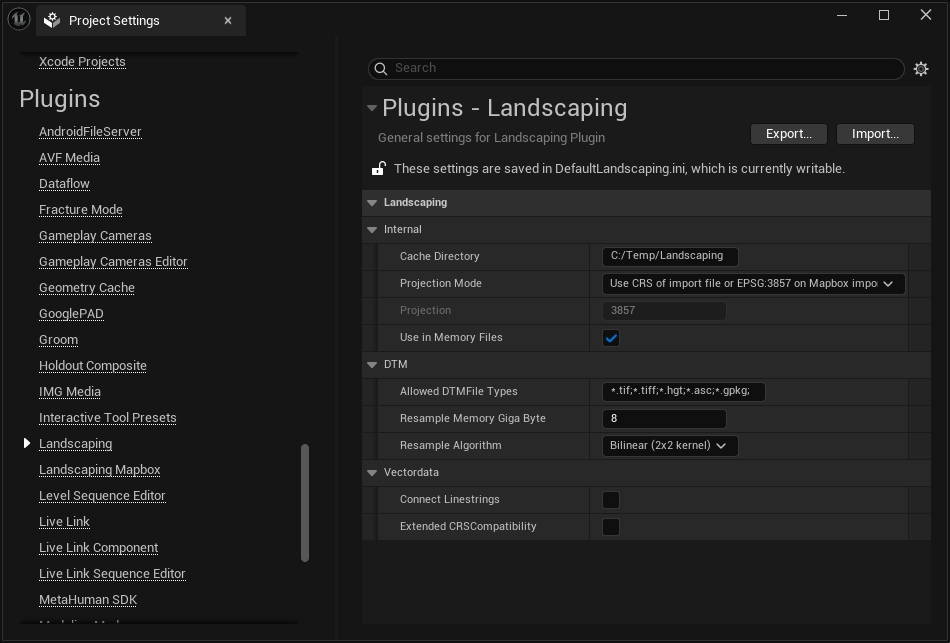

# Settings

Landscaping System does provide settings which are saved per project and can be found in `Project Settings -> Plugins -> Landscaping`.  
For settings of __Landscaping Mapbox__ see [Landscaping Mapbox](mapbox.md?id=settings)  

  

## Internal

### Cache Directory

When importing heightdata (DTM files), intermediate files are generated. They are necessary to circumvent the 2 GB import restriction from Unreal Engine. Please make sure it is set to a writable directory. The plugin will try to create the directory, if it does not exist already.

> The Cache Directory defaults to `C:/Temp/Landscaping` on Windows and `/tmp/Landscaping_Cache` on Linux and MacOS.

### Projection Mode

Projection mode for imported geospatial data. This should be set before importing any data and never changed when working on a map.

> All data must have a CRS with unit meter. If the CRS has unit degree, the projection mode has to be set to `Automatically reproject to appropriate UTM CRS`

#### Automatically reproject to appropriate UTM CRS

UTM CRS (Coordinate Reference System) will be determined by the first imported heightmap or shapefile. On Mapbox Imports this will be EPSG:3857. All imported data will then be reprojected to the determined CRS.

#### Use CRS of import file or EPSG:3857 on Mapbox import

Import data will not be reprojected to UTM, but the heightmap's or shapefile's CRS will be used. All data imported afterwards will be reprojected to this CRS. Please make sure that the imported data is in meter to get the real scale.

#### Use custom CRS specified below

Reproject imported data to the CRS specified under `Projection`.

### Projection

EPSG code of target CRS to use when importing height data.  
E.g. 3395 for Mercator WGS84.  

> IMPORTANT: only easting/northing CRS with unit meter will work. If using feet, the `Landscape Scale Factor` has to be set accordingly - see [Scale](landscapinginfos.md?id=scale).

### Use in Memory Files

Only create intermediate files in memory and not on disk. This will lead to faster imports. Uncheck this, if you want to use intermediate files in other applications.

## DTM

### Allowed DTM File Types

Filetypes recognized for importing DTM files. See also [LandscapingInfos](andscapinginfos.md?id=allowed-dtm-file-types) for more information.

### Resample Memory Giga Byte

The amount of RAM reserved for resampling raster data. Higher values lead to faster resampling.  

### Resample Algorithm

Which algrithm to use for resampling raster data. Bilinear is default and does provide the best output.  

  

## Vectordata

## Connect Linestrings

Vector data with linestrings to create e.g. spline-based roads or rivers can be auto-connected. The linestrings are connected by name.  
Set this to `true`, if there are segmented non-branching roads or rivers.  
Set it to `false` (default), if there are branches.  
The following map shows a branching river (Tiefenbach) - here linestrings cannot be connected in an meaningful way - therefore the value should be set to `false`. This will result in one spline per river branch.  

## Video

Youtube video where the settings are explained:  
